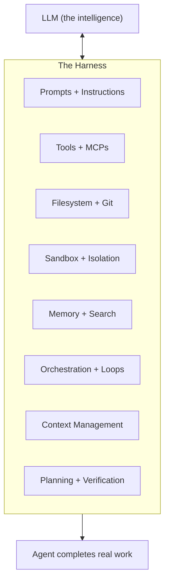
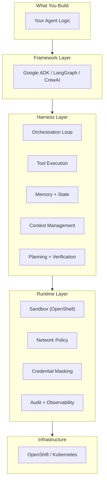

# Understanding Agent Architecture

How AI agents are built, run, and secured — the components, the terminology, and how they fit together.

## The Formula

```
Agent = Model + Harness
```

A model alone is not an agent. A model takes in text and outputs text. It cannot:

- Maintain state across interactions
- Execute code or call APIs
- Access real-time knowledge
- Set up environments
- Remember anything between sessions

**The harness is everything that isn't the model.** It's the system that turns a language model from "answers questions" into "actually does work."

!!! quote "LangChain, March 2026"
    "A harness is every piece of code, configuration, and execution logic that isn't the model itself. If you're not the model, you're the harness."

---

## What a Harness Contains

Each harness component exists because there's a behavior we want from the agent that the model can't deliver alone:

| Desired behavior | What the harness adds | Why the model needs it |
|---|---|---|
| Work with real data durably | Filesystem + Git | Model only sees its context window — needs persistent storage |
| Execute actions autonomously | Bash + code execution | Model outputs text — can't run commands by itself |
| Operate safely | Sandbox + network isolation | Model-generated code could do anything — needs boundaries |
| Remember and learn | Memory files + search + MCPs | Model has no memory between calls — needs external state |
| Stay effective over long tasks | Compaction + context management | Performance degrades as context fills — needs pruning strategy |
| Complete complex multi-step work | Planning loops + verification | Model tends to stop early or drift — needs structure to persist |



---

## Harness vs Runtime vs Framework

These three terms cause the most confusion. Here's the industry-standard distinction:

### Framework

**What you use to BUILD an agent.**

A framework is a build-time library — it gives you the primitives to define agents (tools, chains, graphs, agent classes) and compose them into systems.

Examples: Google ADK, LangGraph, CrewAI, Semantic Kernel

### Harness

**The complete system around the model that makes it an agent.**

The harness is the runtime application layer — orchestration loops, tools, memory, filesystem, sandbox, context management, planning. Everything the model needs to do real work.

Examples: LangChain Deep Agents (`dcode`), Claude Code, OpenClaw, OpenHands

### Agent Runtime (Infrastructure)

**The execution environment that enforces isolation, governance, and durability.**

The runtime is the infrastructure layer below the harness. It handles:

- Where the agent process runs (container, VM, sandbox)
- What it's allowed to access (network policy, filesystem restrictions)
- How state is persisted (sessions, checkpoints)
- How it's observed (traces, audit logs)

Examples: OpenShell, E2B, Modal, Fly Machines

!!! info "Key insight"
    Under LangChain's definition, the sandbox/runtime is a **component of the harness** — one piece of the larger system. Under the infrastructure industry's definition (Credal, ArXiv), it's a **separate layer**. Both views are valid — they just draw the boundary differently.

---

## How They Relate



---

## Product Mapping

How real products map to these layers:

| Product | Framework | Harness | Runtime / Sandbox | Infrastructure |
|---|---|---|---|---|
| **Claude Code** | Anthropic SDK | Built-in (full) | Built-in sandbox | Your machine |
| **LangChain Deep Agents** | LangGraph | `dcode` (full) | OpenShell via NemoClaw | Any (laptop, K8s) |
| **Google ADK** | ADK | Partial (Runner + Sessions + Workflows) | None built-in | Cloud Run / GKE / Agent Runtime |
| **OpenClaw** | OpenClaw | Built-in (gateway + heartbeat + memory) | OpenShell via NemoClaw | Any (laptop, server) |
| **OpenShell** | — | — | **This is the runtime** | K8s / Docker / VM |
| **NemoClaw** | — | Packages a supported harness | OpenShell (bundled) | Any NVIDIA hardware |
| **ACP** | — | Runner bridges (per framework) | OpenShell (managed) | OpenShift |

---

## What ADK Provides (and Doesn't)

Google ADK is a **framework + partial harness**. It gives you build-time primitives AND some runtime capabilities:

| Harness component | ADK provides? | Details |
|---|---|---|
| Orchestration loop | Yes | Runner with event loop (yield/pause/resume) |
| Tools + MCPs | Yes | `FunctionTool`, MCP integration |
| Session persistence | Yes | `DatabaseSessionService` (PostgreSQL, Firestore, Vertex AI) |
| Memory | Yes | `MemoryBankService` |
| Multi-agent workflows | Yes | Graph-based, dynamic, collaborative workflows |
| Ambient (event-driven) | Yes | Pub/Sub, Eventarc, Cloud Scheduler triggers |
| Filesystem + Git | No | Add as custom tools |
| Code execution (bash) | No | Add as custom tool |
| Sandbox / isolation | No | Use OpenShell |
| Context compaction | No | Manage yourself |
| Ralph Loops (continue across windows) | No | Manage yourself |
| Self-verification | No | Implement via workflow nodes |

**For enterprise workflow agents** (short-lived, request/response), ADK's partial harness is usually sufficient.

**For long-running autonomous agents** (coding, research, always-on), you need additional harness components that ADK doesn't provide.

---

## Where OpenShell Fits

OpenShell provides the **sandbox/runtime component** of a harness. Specifically:

| What OpenShell does | Harness component it fulfills |
|---|---|
| Network namespace + OPA proxy | Sandbox — safe execution environment |
| Landlock + seccomp | Sandbox — filesystem and syscall isolation |
| `inference.local` routing | Credential masking — agent never sees API keys |
| OCSF logging | Observability — audit trail of all agent actions |
| Network policy (per-binary, per-host, per-method) | Sandbox — granular access control |
| Hot-reloadable policy | Sandbox — adapt permissions without restart |

**OpenShell doesn't provide:**

- Orchestration loops (that's your harness/framework)
- Memory or session persistence (that's ADK/LangGraph)
- Planning or verification (that's your agent logic)
- Context management (that's your harness)

**OpenShell's value:** "No matter what harness or framework you use, we make sure the agent can only do what the policy allows."

---

## Decision Guide

### "Which pieces do I need?"

=== "Short-lived workflow agent"

    Your agent handles a request, does some tool calls, returns a result.

    **You need:** Framework (ADK) + Runtime (OpenShell if calling external APIs)

    **You don't need:** Full harness, filesystem, compaction, Ralph Loops

=== "Long-running coding agent"

    Your agent works for hours writing code, running tests, pushing PRs.

    **You need:** Full harness (Deep Agents / Claude Code) + Runtime (OpenShell)

    **Or:** Framework (ADK/LangGraph) + build your own harness components + OpenShell

=== "Always-on personal assistant"

    Your agent runs 24/7, responds to messages, takes actions proactively.

    **You need:** Full harness (OpenClaw / Hermes) + Runtime (OpenShell via NemoClaw)

=== "Enterprise multi-tenant"

    Multiple teams running multiple agents with governance.

    **You need:** Platform (ACP) + Full harness or framework + Runtime (OpenShell)

---

## The Stack on OpenShift

For this reference architecture, the stack is:

```
┌─────────────────────────────────────────┐
│ Your Agent (ADK / LangGraph / custom)   │  ← You build this
├─────────────────────────────────────────┤
│ Framework harness components            │  ← ADK Runner, Sessions,
│ (orchestration, memory, tools)          │     Workflows, Memory
├─────────────────────────────────────────┤
│ OpenShell (sandbox runtime)             │  ← Network policy, isolation,
│                                         │     inference routing, audit
├─────────────────────────────────────────┤
│ Agent Sandbox Controller (operator)     │  ← Creates pods from Sandbox CRs
├─────────────────────────────────────────┤
│ OpenShift (compute platform)            │  ← Scheduling, networking,
│                                         │     storage, RBAC
└─────────────────────────────────────────┘
```

Each layer has a single responsibility. Your agent code doesn't know about OpenShell. OpenShell doesn't know about your agent logic. OpenShift doesn't know about either — it just runs pods.

---

## Further Reading

- [LangChain: The Anatomy of an Agent Harness](https://www.langchain.com/blog/anatomy-of-an-agent-harness) (March 2026)
- [Credal: Agent Harness vs Agent Runtime](https://www.credal.ai/blog/agent-harness-vs-agent-runtime)
- [ArXiv: AI Runtime Infrastructure](https://www.arxiv.org/pdf/2603.00495) (2026)
- [Google ADK Documentation](https://adk.dev)
- [NVIDIA NemoClaw Documentation](https://docs.nvidia.com/nemoclaw/latest/)
- [OpenShell Documentation](https://docs.nvidia.com/openshell/latest/)
