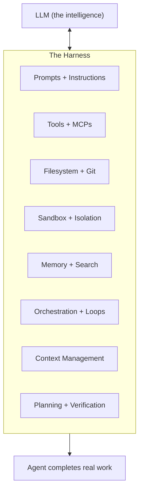
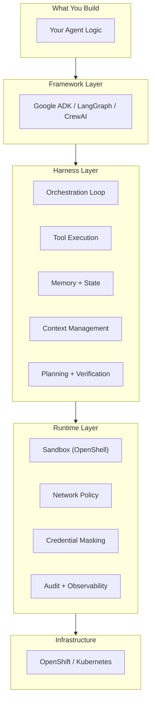

# Understanding Agent Architecture

How AI agents are built, run, and secured — the components, the terminology, and how they fit together.

<div class="grid cards" markdown>

-   :material-arrow-right-circle:{ .lg .middle } __See your personalized stack__

    ---

    Pick your agent, select your requirements, get your architecture in 30 seconds.

    [:octicons-arrow-right-24: Interactive Wizard](stack-wizard.html)

</div>

!!! abstract "TL;DR"
    | Layer | What it does | Example |
    |---|---|---|
    | **Model** | Reasons and decides | Claude, Gemini, GPT, Nemotron |
    | **Harness** | Makes the model useful (tools, memory, loops, filesystem) | Claude Code, ADK, Deep Agents |
    | **Runtime** | Makes it safe (isolation, policy, credential masking, audit) | OpenShell |

## The Formula

```
Agent = Model + Harness
```

A model alone is not an agent. A model takes in text and outputs text. It cannot:

- Maintain state across interactions
- Execute code or call APIs
- Access real-time knowledge
- Set up environments
- Remember anything between sessions

**The harness is everything that isn't the model.** It's the system that turns a language model from "answers questions" into "actually does work."

!!! quote "LangChain, March 2026"
    "A harness is every piece of code, configuration, and execution logic that isn't the model itself. If you're not the model, you're the harness."

---

## What a Harness Contains

Each harness component exists because there's a behavior we want from the agent that the model can't deliver alone:

| Desired behavior | What the harness adds | Why the model needs it |
|---|---|---|
| Work with real data durably | Filesystem + Git | Model only sees its context window — needs persistent storage |
| Execute actions autonomously | Bash + code execution | Model outputs text — can't run commands by itself |
| Operate safely | Sandbox + network isolation | Model-generated code could do anything — needs boundaries |
| Remember and learn | Memory files + search + MCPs | Model has no memory between calls — needs external state |
| Stay effective over long tasks | Compaction + context management | Performance degrades as context fills — needs pruning strategy |
| Complete complex multi-step work | Planning loops + verification | Model tends to stop early or drift — needs structure to persist |



---

## Harness vs Runtime vs Framework

These three terms cause the most confusion. Here's the industry-standard distinction:

### Framework

**What you use to BUILD an agent.**

A framework is a build-time library — it gives you the primitives to define agents (tools, chains, graphs, agent classes) and compose them into systems.

Examples: Google ADK, LangGraph, CrewAI, Semantic Kernel

### Harness

**The complete system around the model that makes it an agent.**

The harness is the runtime application layer — orchestration loops, tools, memory, filesystem, sandbox, context management, planning. Everything the model needs to do real work.

Examples: LangChain Deep Agents (`dcode`), Claude Code, OpenClaw, OpenHands

### Agent Runtime (Infrastructure)

**The execution environment that enforces isolation, governance, and durability.**

The runtime is the infrastructure layer below the harness. It handles:

- Where the agent process runs (container, VM, sandbox)
- What it's allowed to access (network policy, filesystem restrictions)
- How state is persisted (sessions, checkpoints)
- How it's observed (traces, audit logs)

Examples: OpenShell, E2B, Modal, Fly Machines

!!! info "Key insight"
    Under LangChain's definition, the sandbox/runtime is a **component of the harness** — one piece of the larger system. Under the infrastructure industry's definition (Credal, ArXiv), it's a **separate layer**. Both views are valid — they just draw the boundary differently.

---

## How They Relate



---

## Product Mapping

**Default policy** matches the upstream [Supported Agents](https://docs.nvidia.com/openshell/latest/about/supported-agents.html) matrix where applicable. Isolation **use-case profiles** in the [Interactive Wizard](stack-wizard.html) are **illustrative field guidance** (suggested compose), not OpenShift AI release-notes SKUs — see Modes 1–2 in the [Red Hat AI + OpenShell blog](https://www.redhat.com/en/blog/red-hat-ai-and-openshell-driving-security-enhanced-agent-execution-for-enterprise-ai) and the [defense-in-depth article](https://developers.redhat.com/articles/2026/05/14/every-layer-counts-defense-depth-ai-agents-red-hat-ai).

### How layers compose (do not conflate)

| Layer | What it is | Owner |
|---|---|---|
| **OpenShift Sandboxed Containers (Kata)** | Hardware / dedicated-kernel isolation | OpenShift (GA layered product) |
| **OpenShell** | In-sandbox policy: Landlock, seccomp, netns, OPA L4/L7, `inference.local`, OCSF | NVIDIA OpenShell (+ Red Hat drivers) |
| **kubernetes-sigs/agent-sandbox** | Sandbox CRD lifecycle (cluster compose) | OpenShift / Kubernetes path |
| **MCP Gateway** | Tool OAuth2 exchange, claim-based auth (Kuadrant/Authorino) | Red Hat AI (check release notes) |
| **ogx / Open Responses** | Mode 2 agentic API surface | Red Hat AI / OGX (packaging maturity varies) |
| **MLflow + OTEL / EvalHub** | Observability & evaluation capabilities | Red Hat OpenShift AI |

**Compose (cluster):** Kata for kernel boundary ∪ OpenShell for application policy ∪ Agent Sandbox operator for Sandbox CR lifecycle. OpenShell does **not** replace OSC or MCP Gateway. **Local / Podman** OpenShell paths use the same app policy without the Agent Sandbox operator. **Kaiden** is an optional local desktop UI that can use OpenShell — not required for `openshell sandbox create`.

### Entry paths (NVIDIA OpenShell / NemoClaw)

| Path | Valid for | Not valid for |
|---|---|---|
| **OpenShell only** (`openshell sandbox create`) | Claude Code, Copilot, OpenCode, Codex (base); Ollama / Pi (`--from`, on Supported Agents); Gemini (`--from gemini`, Community catalog only); BYO images | Claiming a NemoClaw blueprint; claiming `--from openclaw` (not in Community today) |
| **NemoClaw blueprint** (`nemoclaw onboard` …) | OpenClaw, Hermes, LangChain Deep Agents Code only | Claude Code, Gemini, OpenCode, Codex as the sandboxed agent; OpenShell-alone OpenClaw via Community `--from` |

Claude Code / Copilot / Codex can appear in NemoClaw docs as the **host installer UI** — that does not make them NemoClaw blueprint agents. On OpenShift AI, OpenShell-path agents run under the OpenShell capability; NemoClaw is an optional NVIDIA reference packaging layer on top of OpenShell for its three agents.

### Agents / frameworks

| Name | Source (NVIDIA matrix) | Default policy | Path | Command |
|---|---|---|---|---|
| **Claude Code** | `base` | Full coverage | OpenShell | `openshell sandbox create -- claude` |
| **GitHub Copilot CLI** | `base` | Full coverage | OpenShell | `openshell sandbox create -- copilot` |
| **OpenCode** | `base` | Partial coverage — add `opencode.ai` + binaries; often `ANTHROPIC_BASE_URL=https://inference.local/v1` | OpenShell | `openshell sandbox create -- opencode` |
| **OpenAI Codex CLI** | `base` | No coverage — custom policy (OpenAI endpoints + Codex binaries) + `OPENAI_API_KEY` | OpenShell | `--policy` + `-- codex` |
| **Gemini CLI** | Community catalog (`gemini`) — **not** on Supported Agents docs table | Bundled (image) | OpenShell | `openshell sandbox create --from gemini` |
| **Ollama** / **Pi** | Community — **on** Supported Agents table | Bundled | OpenShell | `--from ollama` / `--from pi` |
| **OpenClaw** | NemoClaw | Blueprint-managed | NemoClaw only | `nemoclaw onboard` |
| **Hermes** | NemoClaw | Blueprint-managed (Tested; production parity with OpenClaw not asserted) | NemoClaw | `nemohermes onboard` |
| **Deep Agents Code** | NemoClaw (may lag OpenShell Supported Agents table) | Blueprint-managed | NemoClaw | `nemo-deepagents onboard` |
| **ADK / LangGraph / CrewAI / Strands / OpenHands / custom** | **BYOA** (not a NVIDIA named row) | You supply policy | OpenShell `--from` | `--from <image>` + policy — common enterprise path; Red Hat AgentOps is framework-agnostic |
| **NemoClaw** | Reference stack | — | — | orchestrates OpenShell |

Use the [Interactive Wizard](stack-wizard.html) for path-accurate stacks. Treat isolation profile badges as illustrative suggestions, not product certification.

!!! note "Identity (Kagenti convergence)"
    Kagenti shipped full SPIRE via AuthBridge (Dev Preview only — no GA). OpenShell authenticates supervisors with **gateway-minted sandbox JWTs / JWT-SVID** (SPIFFE-shaped subjects) and is **closing the SPIFFE gap**; Red Hat contributes OIDC + SPIFFE identity drivers. Platform SPIFFE/SPIRE on OpenShift layers on for cluster zero-trust — complementary, not “OpenShell already is full SPIRE.”

!!! note "Maturity (public sources only)"
    OpenShell upstream is **alpha** (single-player-first) — [NVIDIA/OpenShell README](https://github.com/NVIDIA/OpenShell). Red Hat blogs (May 2026) describe OpenShell as **planned for integration** into Red Hat AI / “coming to” OpenShift AI, with **early validations that are not shipping product features yet**. OpenShell is **not** listed as Developer Preview or Tech Preview in public [OpenShift AI 3.5 release notes](https://docs.redhat.com/en/documentation/red_hat_openshift_ai_self-managed/3.5/html/release_notes/developer-preview-features_relnotes) (checked 2026-07-19). Do not treat field “DP 3.5 → TP 3.6” targets as product fact until they appear in docs.redhat.com.

---

## What ADK Provides (and Doesn't)

Google ADK is a **framework + partial harness**. It gives you build-time primitives AND some runtime capabilities:

| Harness component | ADK provides? | Details |
|---|---|---|
| Orchestration loop | Yes | Runner with event loop (yield/pause/resume) |
| Tools + MCPs | Yes | `FunctionTool`, MCP integration |
| Session persistence | Yes | `DatabaseSessionService` (PostgreSQL, Firestore, Vertex AI) |
| Memory | Yes | `MemoryBankService` |
| Multi-agent workflows | Yes | Graph-based, dynamic, collaborative workflows |
| Ambient (event-driven) | Yes | Pub/Sub, Eventarc, Cloud Scheduler triggers |
| Filesystem + Git | No | Add as custom tools |
| Code execution (bash) | No | Add as custom tool |
| Sandbox / isolation | No | Use OpenShell |
| Context compaction | No | Manage yourself |
| Ralph Loops (continue across windows) | No | Manage yourself |
| Self-verification | No | Implement via workflow nodes |

**For enterprise workflow agents** (short-lived, request/response), ADK's partial harness is usually sufficient.

**For long-running autonomous agents** (coding, research, always-on), you need additional harness components that ADK doesn't provide.

---

## Where OpenShell Fits

OpenShell provides the **application-level sandbox** in Red Hat AI's defense-in-depth model (Mode 1 whole-agent; composes with Mode 2 via ogx). Specifically:

| What OpenShell does | Layer |
|---|---|
| Network namespace + OPA proxy (L4 + optional L7 / MCP-aware) | Application runtime policy |
| Landlock + seccomp | OS-level controls inside the sandbox |
| `inference.local` routing | Credential masking / privacy router |
| OCSF v1.7.0 logging | Security audit (SIEM) — not MLflow product tracing |
| Hot-reloadable network/inference policy | Operational flexibility |

**OpenShell doesn't provide (other OpenShift AI capabilities / cluster controls do):**

- Kata / OSC hardware isolation (L5)
- MCP Gateway tool OAuth exchange (Kuadrant/Authorino)
- ogx / Open Responses Mode-2 API surface
- MLflow / OTEL, EvalHub, Garak, NeMo Guardrails (safety & evaluation portfolio)
- Orchestration loops, memory, planning (harness/framework)

**OpenShell's value (field line):** Agents are zero-trust employees — OpenShell makes sure the agent can only do what policy allows, portably from laptop (Podman) to OpenShift.

---

## Decision Guide

### "Which pieces do I need?"

=== "Short-lived workflow agent"

    Your agent handles a request, does some tool calls, returns a result.

    **You need:** Framework (ADK) + Runtime (OpenShell if calling external APIs)

    **You don't need:** Full harness, filesystem, compaction, Ralph Loops

=== "Long-running coding agent"

    Your agent works for hours writing code, running tests, pushing PRs.

    **You need:** Full harness (Deep Agents / Claude Code) + Runtime (OpenShell)

    **Or:** Framework (ADK/LangGraph) + build your own harness components + OpenShell

=== "Always-on personal assistant"

    Your agent runs 24/7, responds to messages, takes actions proactively.

    **You need:** Full harness (OpenClaw / Hermes) + Runtime (OpenShell via NemoClaw)

=== "Enterprise multi-tenant"

    Multiple teams running multiple agents with governance.

    **You need:** Framework (ADK/LangGraph) + Runtime (OpenShell with OIDC) on OpenShift projects/RBAC. OpenShift AI workspaces are a platform surface on top — not an OpenShell core feature.

---

## The Stack on OpenShift

For this reference architecture (BYOA on Red Hat AI):

```
┌─────────────────────────────────────────┐
│ Model — Inference & APIs                │  ← Intelligence (weights / APIs)
├─────────────────────────────────────────┤
│ Harness — BYOA (tools, loops, FS, …)    │  ← Agent = Model + Harness
├─────────────────────────────────────────┤
│ OpenShift AI capabilities (not products)│
│  · OpenShell (app sandbox runtime)      │  ← OPA, Landlock, seccomp,
│  · Isolation / tenancy / MCP Gateway    │     inference.local, OCSF
│  · Safety & eval (TrustyAI portfolio)   │  ← Guardrails, EvalHub, Garak,
│                                         │     MLflow/OTEL
├─────────────────────────────────────────┤
│ Red Hat OpenShift AI (the product)      │  ← Everything above runs on this
└─────────────────────────────────────────┘
         │ sits on
         ▼
┌─────────────────────────────────────────┐
│ Red Hat OpenShift (cluster platform)    │  ← Outside this agent diagram:
│                                         │     SCC/RBAC, operators, GPUs
└─────────────────────────────────────────┘
```

Each layer has a single responsibility. Kagenti (Dev Preview) converged into this OpenShell-centered runtime story; MCP Gateway / SPIFFE platform work continues as Red Hat AI platform layers — not as a return to Kagenti.

---

## Further Reading

- [LangChain: The Anatomy of an Agent Harness](https://www.langchain.com/blog/anatomy-of-an-agent-harness) (March 2026)
- [Credal: Agent Harness vs Agent Runtime](https://www.credal.ai/blog/agent-harness-vs-agent-runtime)
- [ArXiv: AI Runtime Infrastructure](https://www.arxiv.org/pdf/2603.00495) (2026)
- [Google ADK Documentation](https://adk.dev)
- [NVIDIA NemoClaw Documentation](https://docs.nvidia.com/nemoclaw/latest/)
- [OpenShell Documentation](https://docs.nvidia.com/openshell/latest/)
