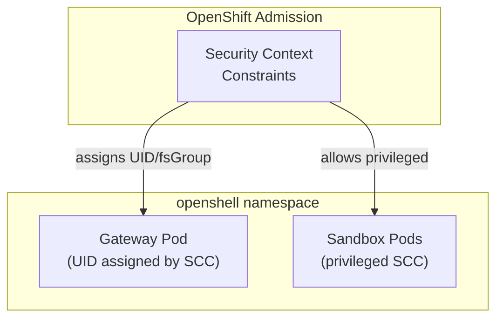

# Prerequisites

Before deploying OpenShell on OpenShift, ensure you have the following tools and access.

## Required Tools

| Tool | Version | Purpose |
|---|---|---|
| `oc` | 4.14+ | OpenShift CLI, authenticated to your cluster |
| `helm` | 3.x | Helm chart deployment |
| `openshell` | Latest | OpenShell CLI for managing sandboxes |

### Install the OpenShell CLI

```shell
curl -LsSf https://raw.githubusercontent.com/NVIDIA/OpenShell/main/install.sh | sh
```

Verify the installation:

```shell
openshell --version
```

### Install Helm

=== "macOS"

    ```shell
    brew install helm
    ```

=== "Linux"

    ```shell
    curl https://raw.githubusercontent.com/helm/helm/main/scripts/get-helm-3 | bash
    ```

## Cluster Requirements

!!! warning "Cluster Admin Required"
    You need `cluster-admin` privileges to create Security Context Constraints bindings and install cluster-scoped CRDs.

- [x] OpenShift 4.14 or later
- [x] RBAC enabled (default on OpenShift)
- [x] Ability to create namespaces
- [x] Ability to assign SCCs to service accounts
- [x] At least 2 GiB available memory for the gateway pod
- [x] Network connectivity to GHCR (`ghcr.io`) for pulling images

## Verify Cluster Access

```shell
oc whoami
oc auth can-i create namespace --all-namespaces
oc auth can-i create clusterrole --all-namespaces
```

All three should succeed. If not, ask your cluster admin for the required privileges.

## Architecture Understanding

Before proceeding, understand the key OpenShift-specific considerations:



**Why privileged SCC?** Sandbox pods need to:

- Create network namespaces for agent isolation
- Mount the supervisor binary via init containers
- Set up nftables rules for bypass detection
- Run Landlock LSM for filesystem isolation

The gateway pod itself runs as non-root with minimal privileges.

---

!!! tip "Next Step"
    [:octicons-arrow-right-24: Install the Agent Sandbox controller](agent-sandbox.md)
