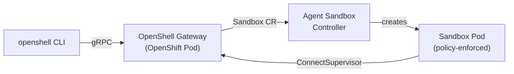

---
hide:
  - navigation
  - toc
---

# OpenShell on OpenShift

Deploy safe, sandboxed AI agent runtimes on Red Hat OpenShift — from first install to production-ready operation.

NVIDIA OpenShell
OpenShift 4.x

## What You'll Build

By the end of this tutorial you will have a fully operational OpenShell gateway on OpenShift, capable of provisioning sandboxed environments for autonomous AI agents with declarative network policies.

---

### :material-rocket-launch: Getting Started

Install prerequisites, deploy the gateway, and verify everything is running.

[:octicons-arrow-right-24: Start here](getting-started/prerequisites.md)

### :material-cube-outline: Using Sandboxes

Create your first sandbox, connect an agent, and configure network policies.

[:octicons-arrow-right-24: Create a sandbox](sandboxes/first-sandbox.md)

### :material-shield-check: Production

Expose externally via OpenShift Routes, add OIDC auth, and configure HA with PostgreSQL.

[:octicons-arrow-right-24: Go to production](production/expose-route.md)

### :material-wrench: Troubleshooting

Common issues on OpenShift and how to resolve them.

[:octicons-arrow-right-24: Get help](troubleshooting.md)

---

## Architecture on OpenShift

OpenShell deploys as a StatefulSet in the `openshell` namespace. The gateway manages sandbox lifecycle through the Kubernetes Agent Sandbox controller, which creates sandbox pods with the OpenShell supervisor injected as a sideloaded binary.

| Component | OpenShift Resource | Namespace |
|---|---|---|
| Gateway | StatefulSet + Service | `openshell` |
| Sandbox pods | Managed by Agent Sandbox controller | `openshell` |
| PKI secrets | Opaque Secrets (auto-generated) | `openshell` |
| RBAC | Role + ClusterRole | `openshell` + cluster |

!!! info "Experimental"
    The OpenShift deployment path is under active development. This tutorial tracks the latest `main` branch and uses TLS-disabled mode for initial evaluation.

---

## Version Compatibility

| Component | Tested Version |
|---|---|
| OpenShift | 4.14+ |
| Helm chart | `0.0.0-dev` (latest main) or `0.6.0`+ |
| Agent Sandbox controller | v0.4.6+ |
| OpenShell CLI | Latest from `install.sh` |
