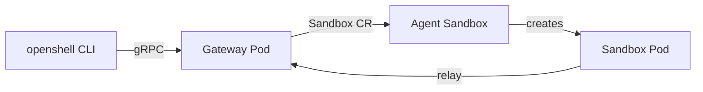

---
hide:
  - navigation
  - toc
---

# OpenShell on OpenShift

Deploy safe, sandboxed AI agent runtimes on Red Hat OpenShift — from first install to production-ready.

NVIDIA OpenShell
OpenShift 4.x

[Get Started :material-arrow-right:](getting-started/prerequisites.md){ .md-button .md-button--primary }
[GitOps Path :material-git:](production/gitops.md){ .md-button }

---

---

-   :material-clock-fast:{ .lg .middle } __Set up in 5 minutes__

    ---

    Install prerequisites, deploy the gateway, create your first sandbox.

    [:octicons-arrow-right-24: Getting started](getting-started/index.md)

-   :material-shield-check:{ .lg .middle } __Policy-enforced isolation__

    ---

    Default-deny networking, L7 inspection, Landlock filesystem, seccomp.

    [:octicons-arrow-right-24: Network policies](sandboxes/network-policies.md)

-   :material-lock:{ .lg .middle } __Zero secrets in Git__

    ---

    Vault + External Secrets Operator. Pre-commit hooks block leaks.

    [:octicons-arrow-right-24: GitOps deployment](production/gitops.md)

-   :material-sitemap:{ .lg .middle } __Choose an agent stack__

    ---

    Decision guide for workflows vs agents, OpenClaw/Hermes, LangGraph/ADK, and sandbox platforms.

    [:octicons-arrow-right-24: Open the guide](agent-stack-decision-guide/index.html)

-   :material-server:{ .lg .middle } __Production ready__

    ---

    OpenShift Routes, OIDC auth, PostgreSQL HA, ArgoCD GitOps.

    [:octicons-arrow-right-24: Production guide](production/index.md)

---

## Tested On

| Component | Version |
|---|---|
| OpenShift | 4.20 (Kubernetes 1.33) |
| OpenShell Helm chart | `0.0.0-dev` |
| Agent Sandbox | v0.4.6 |
| External Secrets Operator | v1 |
| HashiCorp Vault | 1.19 (dev mode) |
