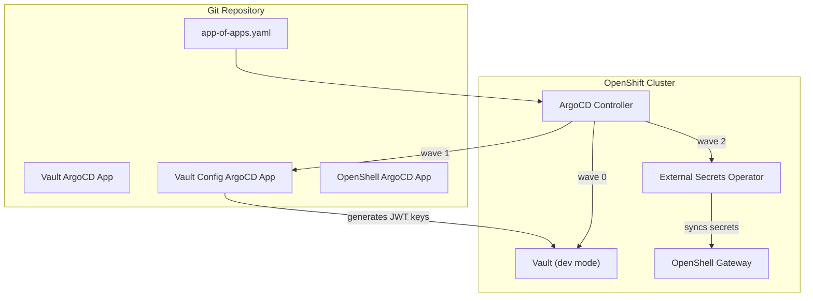

# GitOps Deployment with ArgoCD

This page describes an alternative deployment path using ArgoCD (OpenShift GitOps) with Vault-backed secrets via the External Secrets Operator. This is the recommended approach for production environments where all cluster state must be declared in Git.

!!! info "Two Paths"
    The [Getting Started](../getting-started/prerequisites.md) tutorial uses manual `helm install`. This page describes the GitOps alternative. Choose one — they are independent.

## Prerequisites

In addition to the [standard prerequisites](../getting-started/prerequisites.md):

- [x] OpenShift GitOps operator installed (provides ArgoCD)
- [x] External Secrets Operator installed
- [x] Agent Sandbox CRDs applied (one-time)

## Architecture



## Deploy

```shell
# One-time: Agent Sandbox CRDs
oc apply -f https://github.com/kubernetes-sigs/agent-sandbox/releases/latest/download/manifest.yaml

# Deploy everything via App-of-Apps
oc apply -f app-of-apps.yaml
```

ArgoCD reconciles the following in order:

1. **Wave 0** — Vault server (Helm chart, dev mode)
2. **Wave 1** — Vault configuration Job (enables K8s auth, creates policies, generates Ed25519 JWT signing keys, stores in Vault, creates `vault-token` Secret for ESO)
3. **Wave 2** — OpenShell (namespace, SCC, SecretStore, ExternalSecret, Helm chart with `pkiInitJob` disabled)

## Verify

After ArgoCD shows all applications as `Synced` and `Healthy`:

```shell
# Check ArgoCD app status
oc get applications -n openshift-gitops

# Verify ESO is syncing secrets from Vault
oc -n openshell get externalsecret
# STATUS should show SecretSynced = True

# Verify gateway is running
oc -n openshell get pods
oc -n openshell port-forward svc/openshell 8080:8080
```

Then register and use the gateway as described in [Verify Installation](../getting-started/verify.md).

## How Secrets Work

No secrets are stored in Git. The flow is:

1. Vault config Job generates Ed25519 JWT keys using `openssl`
2. Keys are written to Vault at `openshell/jwt-keys`
3. ESO `SecretStore` authenticates to Vault using a token Secret (created by the same Job)
4. ESO `ExternalSecret` syncs keys from Vault into K8s Secret `openshell-jwt-keys`
5. Gateway mounts the K8s Secret as a volume

Key rotation: update the keys in Vault (manually or via automation), ESO refreshes every hour.

## Files

All manifests live in the repository root:

| File | Purpose |
|---|---|
| `app-of-apps.yaml` | Single entry point (apply this to bootstrap) |
| `argocd-app.yaml` | OpenShell Helm + kustomize Application |
| `infra/vault/argocd-app.yaml` | Vault Helm chart Application |
| `infra/vault-config/` | Vault auth, policies, JWT keygen Job |
| `base/values-base.yaml` | Shared Helm values (OpenShift SCC overrides) |
| `overlays/openshift-dev/` | Dev: TLS disabled, ESO SecretStore + ExternalSecret |

---

!!! tip "Next Step"
    [:octicons-arrow-right-24: Troubleshooting](../troubleshooting.md) if you encounter issues.
