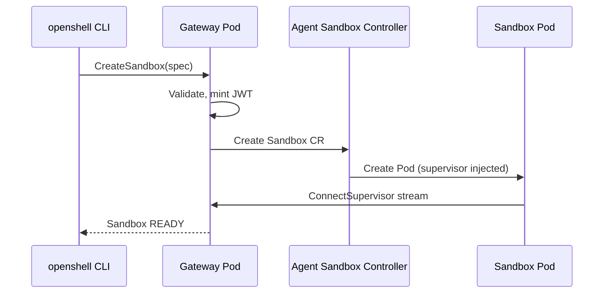

# Create Your First Sandbox

With the gateway verified, create a sandbox to confirm end-to-end operation.

## Prerequisites

- [x] Gateway is running and `openshell status` shows `connected`
- [x] Port-forward active: `oc -n openshell port-forward svc/openshell 8080:8080`

## Create a Sandbox

```shell
openshell sandbox create --name my-first-sandbox
```

This triggers the following flow:



## Watch the Sandbox Start

In another terminal:

```shell
oc -n openshell get pods -w -l openshell.ai/managed-by=openshell
```

You should see a sandbox pod transition through `Init` → `Running`:

```
NAME                                    READY   STATUS     RESTARTS   AGE
my-first-sandbox-abc123                 0/1     Init:0/1   0          2s
my-first-sandbox-abc123                 1/1     Running    0          8s
```

## Check Sandbox Status

```shell
openshell sandbox get my-first-sandbox
```

The output shows the sandbox name, phase (`Ready`), and policy configuration. The exact format varies by CLI version.

## Connect to the Sandbox

Open an interactive SSH session:

```shell
openshell sandbox connect my-first-sandbox
```

You're now inside the sandboxed environment. Try some commands:

```shell
whoami          # sandbox
hostname        # sandbox hostname
```

Try an outbound network request to see default-deny in action:

```shell
curl -s https://example.com
```

```text
curl: (56) Received HTTP code 403 from proxy after CONNECT
```

The request is denied because no network policy allows outbound traffic. This is the secure default — see [Network Policies](../sandboxes/network-policies.md) to learn how to allow specific endpoints.

Exit with ++ctrl+d++ or `exit`.

## Exec a Command

Run a one-shot command without an interactive session:

```shell
openshell sandbox exec --name my-first-sandbox -- echo "Hello from OpenShift sandbox"
```

## Delete the Sandbox

```shell
openshell sandbox delete my-first-sandbox
```

Verify the pod is removed:

```shell
oc -n openshell get pods -l openshell.ai/managed-by=openshell
```

---

!!! tip "Next Step"
    [:octicons-arrow-right-24: Connect an AI agent to a sandbox](connect-agent.md)
