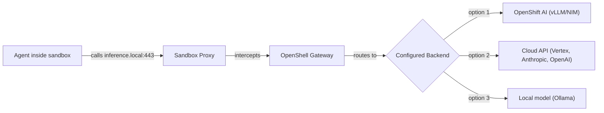

# Inference Routing

OpenShell intercepts calls to `inference.local` and routes them to your configured LLM backend. The agent never sees real API keys or endpoint URLs.



## Why inference.local?

| Without inference routing | With inference routing |
|---|---|
| Agent has real API keys in env vars | Agent sees `ANTHROPIC_API_KEY=unused` |
| Agent knows the real endpoint URL | Agent calls `inference.local` (generic) |
| Changing providers requires code changes | Change provider on gateway — agent unchanged |
| No audit of model calls | Every inference call logged |

## Configure a Provider

=== "Anthropic (Cloud)"

    ```shell
    openshell provider create --name anthropic --type anthropic
    ```

    You'll be prompted for your API key. It's stored on the gateway, never exposed to sandboxes.

=== "Google Vertex AI"

    ```shell
    openshell provider create \
      --name vertex-prod \
      --type google-vertex-ai \
      --from-gcloud-adc \
      --config VERTEX_AI_PROJECT_ID=your-project \
      --config VERTEX_AI_REGION=us-central1
    ```

=== "OpenShift AI (vLLM/NIM)"

    ```shell
    openshell provider create \
      --name openshift-ai \
      --type openai-compatible \
      --config BASE_URL=http://vllm-server.ai-models.svc.cluster.local:8000/v1
    ```

    Point to your vLLM or NIM inference service running in your OpenShift AI namespace.

=== "Ollama (Local)"

    ```shell
    openshell provider create \
      --name ollama \
      --type openai-compatible \
      --config BASE_URL=http://host.docker.internal:11434/v1
    ```

## Enable Provider Pipeline and Set Route

```shell
openshell settings set --global --key providers_v2_enabled --value true --yes
openshell inference set --provider <your-provider-name> --model <model-name>
```

Example with Anthropic:

```shell
openshell inference set --provider anthropic --model claude-sonnet-4-20250514
```

Example with OpenShift AI:

```shell
openshell inference set --provider openshift-ai --model llama3.1-8b
```

## Verify Inference Routing

Create a sandbox and test:

```shell
openshell sandbox create --name inference-test
```

Inside the sandbox:

```shell
curl -s https://inference.local/v1/chat/completions \
  -H "Content-Type: application/json" \
  -d '{"model": "unused", "messages": [{"role": "user", "content": "Say hello in one word"}]}'
```

!!! warning "Network policy required"
    If you get `403 from proxy`, you need to allow `inference.local` in the sandbox policy:

    ```shell
    # From host terminal:
    openshell policy update inference-test \
      --add-endpoint inference.local:443 \
      --wait
    ```

    Then retry the curl command.

## Run an Agent with inference.local

=== "Claude Code"

    ```shell
    ANTHROPIC_BASE_URL=https://inference.local \
    ANTHROPIC_API_KEY=unused \
    claude --bare
    ```

=== "Google ADK"

    Set in your agent code or env:

    ```shell
    BASE_URL=https://inference.local/v1 \
    API_KEY=unused \
    python agent.py
    ```

=== "OpenAI Codex"

    ```shell
    OPENAI_BASE_URL=https://inference.local/v1 \
    OPENAI_API_KEY=unused \
    codex
    ```

=== "Any OpenAI-compatible agent"

    ```shell
    export OPENAI_BASE_URL=https://inference.local/v1
    export OPENAI_API_KEY=unused
    # Your agent code uses the standard OpenAI SDK
    python my_agent.py
    ```

## How It Works Internally

1. Agent calls `https://inference.local/v1/chat/completions`
2. Sandbox proxy intercepts the DNS name `inference.local`
3. Proxy forwards to the OpenShell gateway
4. Gateway looks up the configured inference route (provider + model)
5. Gateway injects the real API key and forwards to the actual endpoint
6. Response returns through the same path

The agent only ever sees `inference.local`. Keys, real URLs, and provider details stay on the gateway.

## Cleanup

```shell
openshell sandbox delete inference-test
```

---

!!! tip "Next Step"
    [:octicons-arrow-right-24: Connect a full agent](connect-agent.md) with inference routing configured.
