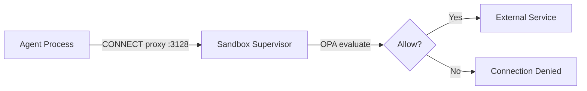

# Network Policies

OpenShell enforces network policies at the sandbox level using OPA (Open Policy Agent). Every outbound connection from an agent passes through a CONNECT proxy that evaluates rules before allowing traffic.

## How It Works



All agent egress is intercepted by the in-sandbox proxy. The OPA engine evaluates each connection against the policy before forwarding.

## Default Policy

Without an explicit policy, sandboxes use a restrictive default:

- **Filesystem**: Standard paths allowed (`/usr`, `/tmp`, workspace)
- **Network**: All outbound connections denied (default-deny)
- **Process**: Dropped to `sandbox` user, seccomp applied

## Create a Network Policy

Create a policy file that allows specific outbound access. The policy uses `network_policies` as a top-level map with named entries:

```yaml title="github-readonly.yaml"
version: 1

filesystem_policy:
  include_workdir: true
  read_only: [/usr, /lib, /proc, /dev/urandom, /app, /etc, /var/log]
  read_write: [/sandbox, /tmp, /dev/null]
landlock:
  compatibility: best_effort
process:
  run_as_user: sandbox
  run_as_group: sandbox

network_policies:
  github_api:
    name: allow-github-readonly
    endpoints:
      - host: api.github.com
        port: 443
        protocol: rest
        access: read-only
      - host: github.com
        port: 443
    binaries:
      - path: /usr/bin/curl
      - path: /usr/bin/git
  pypi_registry:
    name: allow-pypi
    endpoints:
      - host: pypi.org
        port: 443
      - host: files.pythonhosted.org
        port: 443
    binaries:
      - path: /usr/bin/pip
      - path: /usr/local/bin/pip
```

!!! info "Full replacement"
    `policy set` replaces the **entire** policy. Include `filesystem_policy`, `landlock`, and `process` sections to preserve sandbox defaults. Use `policy update` for incremental changes.

## Apply the Policy

### At sandbox creation

```shell
openshell sandbox create --name policy-sandbox --policy github-readonly.yaml
```

### Update an existing sandbox

```shell
openshell policy set policy-sandbox --policy github-readonly.yaml --wait
```

The supervisor hot-reloads the policy without restarting the sandbox. `--wait` blocks until the sandbox confirms the new policy is loaded.

## Verify Policy Enforcement

Connect to the sandbox and test:

```shell
openshell sandbox connect policy-sandbox
```

Inside the sandbox:

```shell
# This should succeed (allowed by policy)
curl -s https://api.github.com/zen
```

```text
Anything added dilutes everything else.
```

```shell
# This should fail (not in policy)
curl -s https://evil-exfiltration.example.com
```

```text
curl: (56) Received HTTP code 403 from proxy after CONNECT
```

Exit with ++ctrl+d++.

## View Denials

```shell
openshell logs policy-sandbox --since 5m
```

Output shows structured deny entries:

```text
action=deny dst_host=evil-exfiltration.example.com dst_port=443 binary=/usr/bin/curl deny_reason="no matching network policy"
```

## Incremental Updates

Add an endpoint without replacing the entire policy:

```shell
openshell policy update policy-sandbox \
  --add-endpoint registry.npmjs.org:443:read-only:rest:enforce
```

## L7 Rules (Advanced)

For finer-grained control, the `protocol: rest` field with `access: read-only` restricts HTTP methods to GET, HEAD, and OPTIONS. For explicit per-path rules:

```yaml title="l7-policy.yaml"
network_policies:
  github_readonly:
    name: github-rest-readonly
    endpoints:
      - host: api.github.com
        port: 443
        protocol: rest
        enforcement: enforce
        access: read-only
    binaries:
      - path: /usr/bin/curl
```

This allows the agent to read from GitHub but prevents any write operations (POST, PUT, DELETE). The proxy auto-detects TLS on HTTPS endpoints and terminates it to inspect each HTTP request.

---

!!! tip "Next Step"
    [:octicons-arrow-right-24: Expose the gateway via OpenShift Route](../production/expose-route.md)
